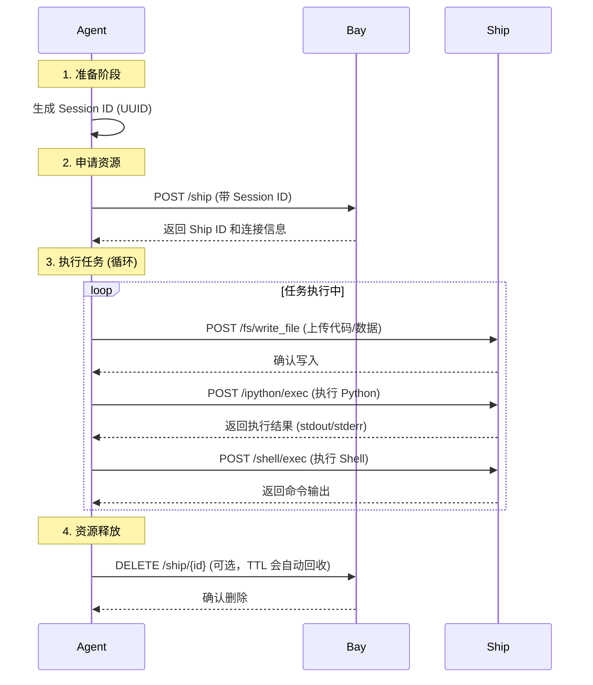

# Agent 集成指南：如何调用 Shipyard

本文档将指导你如何将 AI Agent 接入 Shipyard，利用其提供的安全沙箱能力。

## 1. 核心概念

在开始之前，理解以下三个概念至关重要：

*   **Bay**: Shipyard 的控制中心。你的 Agent 主要与 Bay 交互，向它申请资源。
*   **Ship**: 实际的执行沙箱。你的代码和命令在这里运行。
*   **Session ID**: 会话标识符。这是 Shipyard 最核心的设计。
    *   同一个 Session ID 对应同一个工作目录（`/workspace/{session_id}`）。
    *   同一个 Session ID 可以跨请求复用 Python 解释器状态。
    *   **最佳实践**: 为每个 Agent 任务或用户会话生成一个唯一的 UUID 作为 Session ID。

## 2. 调用流程

标准的调用生命周期如下：



## 3. 接入方式

### 方式一：使用 Python SDK（推荐）

如果你使用 Python 开发 Agent，SDK 是最便捷的方式。

**安装**
```bash
pip install shipyard-python-sdk
```

**代码示例**

```python
import asyncio
import uuid
from shipyard_python_sdk import ShipyardClient, Spec

async def run_agent_task():
    # 1. 初始化客户端
    client = ShipyardClient(
        endpoint_url="http://localhost:8156", # Bay 服务地址
        access_token="secret-token"           # 鉴权 Token
    )
    
    # 2. 生成 Session ID
    session_id = str(uuid.uuid4())
    print(f"Task Session ID: {session_id}")

    try:
        # 3. 创建或获取 Ship (沙箱)
        # ttl: 存活时间(秒), spec: 资源规格
        ship = await client.create_ship(
            ttl=3600, 
            spec=Spec(cpus=1.0, memory="512m")
        )
        
        # 4. 文件操作：写入数据
        await ship.fs.write_file(
            "data.csv", 
            "name,age\nAlice,30\nBob,25"
        )
        
        # 5. Python 执行：数据分析
        # 注意：代码在 IPython 内核中运行，状态会保留
        code = """
import pandas as pd
df = pd.read_csv('data.csv')
print(df.describe())
mean_age = df['age'].mean()
        """
        result = await ship.python.exec(code)
        print("Python Output:", result.text)
        
        # 6. Shell 执行：查看文件
        shell_res = await ship.shell.exec("ls -l")
        print("Shell Output:", shell_res.stdout)

    finally:
        # 7. 清理资源 (可选，也可以留给 TTL 自动清理以供后续复用)
        await client.close()

if __name__ == "__main__":
    asyncio.run(run_agent_task())
```

### 方式二：直接调用 HTTP API

适用于非 Python 环境（如 Node.js, Go, Java 等）。

**1. 创建 Ship**
*   **Endpoint**: `POST http://bay-url/ship`
*   **Headers**: 
    *   `Authorization: Bearer <token>`
    *   `X-SESSION-ID: <your-session-id>`
*   **Body**: `{"ttl": 3600}`

**2. 执行 Python 代码**
*   **Endpoint**: `POST http://ship-url/ipython/exec` (注意：这里直接请求 Ship 的地址，或者通过 Bay 代理)
*   **Headers**: `X-SESSION-ID: <your-session-id>`
*   **Body**: `{"code": "print('hello')"}`

**3. 执行 Shell 命令**
*   **Endpoint**: `POST http://ship-url/shell/exec`
*   **Headers**: `X-SESSION-ID: <your-session-id>`
*   **Body**: `{"command": "ls -la"}`

## 4. 最佳实践

1.  **Session ID 管理**: 始终为每个独立的任务上下文使用唯一的 Session ID。如果 Agent 需要“记忆”之前的变量，请复用同一个 Session ID。
2.  **错误处理**: 总是检查 API 返回的状态码。Shipyard 会在执行出错时返回详细的错误信息。
3.  **资源清理**: 虽然 Shipyard 有 TTL（超时自动销毁）机制，但显式调用 DELETE 接口可以更高效地释放资源。
4.  **安全**: 不要在沙箱中存储敏感密钥。如果需要访问外部 API，建议通过环境变量或临时文件传入 Token，并在使用后立即删除。
